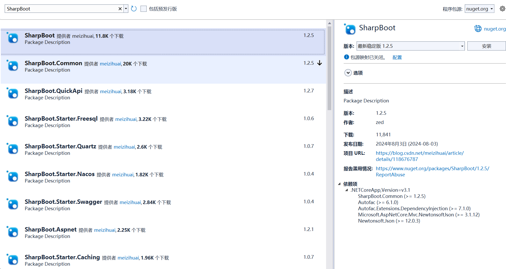

## asp.net core 高级封装 SharpBoot

 - 初衷：asp.net core *IOC AOP Configuration* 等等均不够简洁，起码不够“一键搞定”
 - 目的：一切为了“简”
 - 其他：熟悉Java SpringBoot的小伙伴可能会感觉很熟悉
 - 套件：SharpBoot.Starter.Redis、SharpBoot.Starter.RabbitMQ、SharpBoot.Starter.Nacos、SharpBoot.Starter.Quartz、SharpBoot.Starter.XXXX等
   
  - 下载：nuget搜索SharpBoot

## 启动
新建.net core 3.1 及以上版本ConsoleApp控制台应用，记住，不用选择Asp.netCore模板，空白控制台项目即可

```csharp
public class Program
    {
        static void Main(string[] args)
        {
            SharpBootApplication.Run<Program>(args);
        }
    }
 
```
## Startup? 
SharpBootApplication.Run已经做了一切，无需使用Startup，当然实在要配置自己的Startup类，SharpBoot也留有方法

```csharp
 [Order] //为你的Startup排序，你想放到第几个执行
 [Component]
 public class MyStartup : IStartupConfig
 {
     public void Configure(IApplicationBuilder app)
     {
        //执行你的操作
     }

     public void ConfigureServices(IServiceCollection services)
     {
       //执行你的操作
     }
 }
```

## 控制器？
SharpBoot已经引用了Asp.netCore所需的一切包，因此，controller/route/apicontroller等一切原框架所熟悉的东西，SharpBoot同样方法使用

## IOC
SharpBoot无需services.AddSingleton() , 知道java SpringBoot框架的都知道 @Service/@Component等等。  SharpBoot提供了 [Component] 特性，并支持原生 Singleton/Transient/Scoped 三种生命周期，通过 Component 特性中的LifeTime属性实现三种不同生命周期的bean注入。
SharpBoot使用Autofac代替原生IOC容器，兼容原生外，功能更加丰富

```csharp
    [Order]  //实现类排序，取List时，按照Order排序
    [Component(LifeTime=ComponentLifeTime.Scoped, Primary=true)]  //支持生命周期、Primary
    public class CheckControllcerImpl : ICheckControllerService
    {
        [Autowired]
        public IList<IUserService> UserServices { get; set; }

        public object Get()
        {
            return UserServices.ToList()[0].Get();
        }
    }
```
同样，注入时，除了原生构造函数依赖注入，还支持 [Autowried] 特性注入，参考SpringBoot

```csharp
 [Autowired] IUserService userService { get; set; }  //property注入
 [Autowired] IUserService userService;               //field注入
 [Autowired] List<UserService> userServices;         //list注入
 [Autowired(Name="UserService-02")] IUserService userService;    //精准注入 对应[Component(Name="UserService-02")]
```
 Bean?


```csharp
//方式一
[Import(typeof(UserInfo), LifeTime = Common.Enums.ComponentLifeTime.Singleton)]
[Component]
public class UserInjecter
{
}

//方式二
[Component]
public class UserInjecter
{
    [Bean]  //bean同样支持生命周期、Primary、Order、Name(精准注入) 等
    public UserInfo GetUserInfo()
    {
       return new UserInfo();
    }
}

```

 ## AOP
 定义一个拦截器

```csharp
 [Component]
    public class TestInterceptor : IInterceptor
    {
        public void Intercept(IInvocation invocation)
        {
            Console.WriteLine(invocation.Method.Name + " invoked");
            invocation.Proceed();
        }
    }
```
需要被拦截的bean

```csharp
    [Component]
    [Intercepter(typeof(TestInterceptor))]
    public class ProxyTester
    {
        public virtual void Test()
        {
            Hander();
        }

        public virtual void Hander()
        {
            Hander2();
        }

        public virtual void Hander2()
        {

        }
    }
```
 ## 配置注入
 application.json配置文件中

```json
 {
   "ServiceName":"测试服务",
   "ConfigTest":{
       "User": {
           "Name": "zed-1",
           "Id": 18
        }
   } 
 }
```
方式一：bean中

```csharp
[Value("ConfigTest:User")] UserInfo user;
```
方式二：ConfigProperty注入到容器中

```csharp
    [ConfigProperty("ConfigTest:User")]
    public class UserInfo
    {       
        public int Id { get; set; }
        public string Name { get; set; }     
    }

    [Component]
    public class UserInfoService
    {     
        [Autowried] UserInfo userInfo;
    }   
```
 ## 快捷配置
 快捷配置HTTPS
```json
appsetting.json文件
 {
   "SSL": {
    "Enable": true, //开启https
    "PfxPath": "ssl/myssl.pfx",
    "KeyPath": "ssl/myssl.txt",  //key写文件中
    "Key": ""   //key直接固定到配置中 (优先)
  },
 }
```
 快捷配置Redis 
```json
appsetting.json文件
 {
    "Redis": {
       "Configname": "sharpboot-redis",
       "Connection": ""
       "DefaultDatabase": 0,
       "InstanceName": "test:sharpboot"
    }
 }
```
 快捷配置xxx 还有很多……

 ## SharpBoot.Starter.XXX

 SharpBoot提供了各种starter，方便扩展



